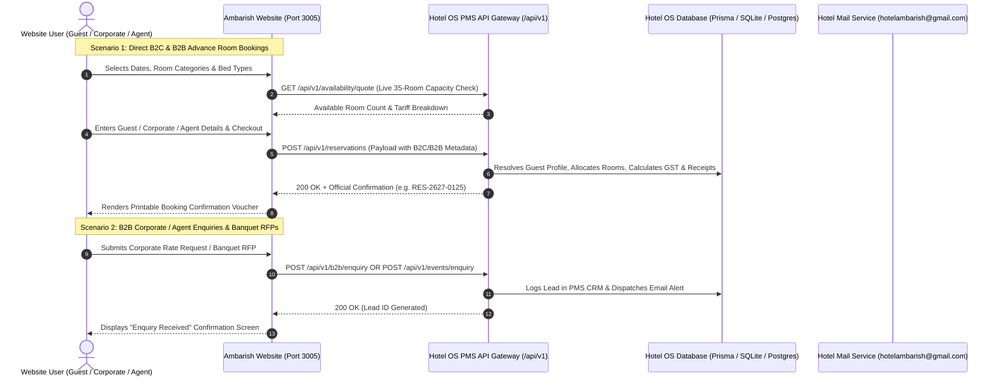

# Hotel Ambarish Grand Residency
## PMS & Website Integration Master Specification (B2C & B2B)

**Author:** Hotel OS Core Architecture Team  
**Target Systems:** Hotel Website Frontend / Booking Engine (Port `3005`) & Hotel OS PMS (Port `3000`)  
**Document Version:** 2.0.0 (Production Master)  

---

## 1. 🏗️ High-Level System Architecture & Flow



---

## 2. 🏨 35 Physical Room Inventory & Bed Type Matrix

The website and booking engine must respect the exact 35 physical room allocation:

| Website Room Name | Bed Type | PMS `roomTypeId` | PMS Code | Inventory | Physical Room Numbers |
| :--- | :--- | :--- | :--- | :---: | :--- |
| **Double Deluxe Room** | **King Bed** | `rt_deluxe_king` | `DELUXE_KING` | **10 Rooms** | 206, 207, 303, 304, 305, 306, 404, 405, 406, 501 |
| **Double Deluxe Room** | **Twin Beds** | `rt_deluxe_twin` | `DELUXE_TWIN` | **15 Rooms** | 301, 302, 308, 310, 311, 401, 402, 403, 408, 409, 410, 411, 504, 505, 506 |
| **Executive Room** | **King Bed** | `rt_exec_king` | `EXEC_KING` | **3 Rooms** | 503, 604, 605 |
| **Executive Room** | **Twin Beds** | `rt_exec_twin` | `EXEC_TWIN` | **5 Rooms** | 309, 601, 602, 606, 607 |
| **Presidential Suite** | **King Bed** | `rt_suite` | `SUITE` | **2 Rooms** | 502, 507 |
| **TOTAL INVENTORY** | — | — | — | **35 Rooms** | Floors 2 to 6 |

---

## 3. 🔌 API Endpoints Reference

### Base Configuration
- **Development PMS URL:** `http://localhost:3000` (or dynamic local port)
- **Production PMS URL:** `https://pms.hotelambarish.com` (or your domain)
- **Headers for all requests:**
  ```http
  Content-Type: application/json
  x-api-key: ambarish_pms_secret_2026
  ```

---

### Endpoint 1: Create Confirmed Reservation (B2C & B2B)
**`POST /api/v1/reservations`**

Used for direct guest reservations, corporate company bookers, and travel agent bookings.

#### Request Payload Schema (B2C & B2B):
```json
{
  "bookingType": "INDIVIDUAL", 
  "source": "WEBSITE",
  "channelRef": "WEB-98421",
  "checkIn": "2026-09-15",
  "checkOut": "2026-09-18",
  "nights": 3,
  "rooms": 2,
  "adults": 4,
  "children": 1,

  "bookedRooms": [
    {
      "categoryCode": "DELUXE_KING",
      "roomName": "Double Deluxe Room",
      "bedType": "King Bed",
      "ratePlanCode": "EP",
      "ratePlanName": "European Plan (Room Only)",
      "pricePerNight": 3200,
      "quantity": 1
    },
    {
      "categoryCode": "DELUXE_TWIN",
      "roomName": "Double Deluxe Room",
      "bedType": "Twin Bed",
      "ratePlanCode": "CP",
      "ratePlanName": "Continental Plan (Breakfast Included)",
      "pricePerNight": 3600,
      "quantity": 1
    }
  ],

  "guestName": "BIJESH SHARMA",
  "guestPhone": "09876543210",
  "guestEmail": "bijesh@example.com",
  "guestCity": "GUWAHATI",
  "guestState": "ASSAM",
  "guestNationality": "INDIAN",
  "guestGstin": "18AAAAA0000A1Z5",

  "b2b": {
    "accountType": "CORPORATE",
    "companyName": "OIL INDIA LIMITED",
    "companyGstin": "18AABCO1234F1ZX",
    "corporateEmail": "traveldesk@oilindia.in",
    "agentName": null,
    "agentPhone": null,
    "agentVoucherNo": null,
    "poNumber": "PO-2026-8812",
    "billingInstruction": "BILL_TO_COMPANY"
  },

  "specialRequests": "Non-smoking room, high floor, early check-in requested",
  "promoCode": "CORP10",
  "discountAmount": 1000,
  "baseAmount": 19400,
  "taxAmount": 970,
  "totalAmount": 20370,
  "paymentMethod": "PAY_AT_HOTEL",
  "paymentId": "PAY_AT_HOTEL",
  "depositAmount": 0
}
```

#### Field Details for B2B & B2C:
| Field | Type | Description |
| :--- | :--- | :--- |
| `bookingType` | `string` | `"INDIVIDUAL"`, `"B2B_CORPORATE"`, `"B2B_TRAVEL_AGENT"`, or `"GROUP"` |
| `source` | `string` | `"WEBSITE"`, `"CORPORATE"`, `"TRAVEL_AGENT"`, or `"DIRECT"` |
| `channelRef` | `string` | Unique order/checkout reference from the website (e.g. `WEB-98421`) |
| `bookedRooms[].categoryCode` | `string` | `"DELUXE_KING"`, `"DELUXE_TWIN"`, `"EXEC_KING"`, `"EXEC_TWIN"`, or `"SUITE"` |
| `bookedRooms[].bedType` | `string` | `"King Bed"` or `"Twin Bed"` |
| `b2b.accountType` | `string` | `"CORPORATE"` or `"TRAVEL_AGENT"` (null for retail guests) |
| `b2b.billingInstruction` | `string` | `"BILL_TO_COMPANY"` (BTC credit), `"PAID_BY_GUEST"`, or `"AGENT_VOUCHER"` |
| `b2b.companyGstin` | `string` | Corporate GSTIN for Input Tax Credit under GST Rule 46 |
| `paymentMethod` | `string` | `"RAZORPAY"` (Online prepaid) or `"PAY_AT_HOTEL"` (Front desk settlement) |
| `depositAmount` | `number` | Advance deposit collected online (e.g., `20370` if paid via Razorpay, `0` if Pay at Hotel) |

#### Response (`200 OK`):
```json
{
  "success": true,
  "confirmationNo": "RES-2627-0125",
  "totalAmount": 20370,
  "reservation": {
    "id": "cmti_res_98234",
    "confirmationNo": "RES-2627-0125",
    "channelRef": "Corporate: OIL INDIA LIMITED - Ref: WEB-98421",
    "status": "CONFIRMED",
    "arrivalDate": "2026-09-15",
    "departureDate": "2026-09-18",
    "totalSnapshot": 20370,
    "roomCount": 2,
    "adults": 4,
    "children": 1,
    "primaryGuest": {
      "name": "BIJESH SHARMA",
      "phone": "09876543210",
      "email": "bijesh@example.com",
      "companyName": "OIL INDIA LIMITED"
    },
    "rooms": [
      {
        "roomTypeId": "rt_deluxe_king",
        "roomTypeName": "Deluxe King Room",
        "adults": 2
      },
      {
        "roomTypeId": "rt_deluxe_twin",
        "roomTypeName": "Deluxe Twin Room",
        "adults": 2
      }
    ],
    "deposits": []
  }
}
```

---

### Endpoint 2: Real-Time Room Availability & Price Quote API
**`GET /api/v1/availability/quote`**

Query live room availability before allowing checkout to prevent overbooking.

#### Query Parameters:
- `arrivalDate`: `YYYY-MM-DD` (e.g. `2026-09-15`)
- `departureDate`: `YYYY-MM-DD` (e.g. `2026-09-18`)
- `roomTypeId` *(optional)*: Specific room type ID or omitted for full hotel breakdown.

#### Example Request:
```http
GET /api/v1/availability/quote?arrivalDate=2026-09-15&departureDate=2026-09-18
```

#### Example Response (`200 OK`):
```json
{
  "arrivalDate": "2026-09-15",
  "departureDate": "2026-09-18",
  "totalRooms": 35,
  "availableRooms": 29,
  "categories": [
    {
      "roomTypeId": "rt_deluxe_king",
      "code": "DELUXE_KING",
      "name": "Deluxe King Room",
      "totalInventory": 10,
      "availableCount": 8,
      "baseRate": 3200
    },
    {
      "roomTypeId": "rt_deluxe_twin",
      "code": "DELUXE_TWIN",
      "name": "Deluxe Twin Room",
      "totalInventory": 15,
      "availableCount": 13,
      "baseRate": 3200
    },
    {
      "roomTypeId": "rt_exec_king",
      "code": "EXEC_KING",
      "name": "Executive King Room",
      "totalInventory": 3,
      "availableCount": 3,
      "baseRate": 4200
    },
    {
      "roomTypeId": "rt_exec_twin",
      "code": "EXEC_TWIN",
      "name": "Executive Twin Room",
      "totalInventory": 5,
      "availableCount": 4,
      "baseRate": 4200
    },
    {
      "roomTypeId": "rt_suite",
      "code": "SUITE",
      "name": "Presidential Suite",
      "totalInventory": 2,
      "availableCount": 1,
      "baseRate": 7500
    }
  ]
}
```

---

### Endpoint 3: B2B Corporate & Travel Agent Onboarding Enquiry
**`POST /api/v1/b2b/enquiry`**

Submitted when a corporate travel manager or travel agency requests a contracted rate agreement or B2B credit account.

#### Request Payload:
```json
{
  "enquiryType": "CORPORATE_RATE_CONTRACT",
  "companyName": "TATA CONSULTANCY SERVICES",
  "accountType": "CORPORATE",
  "contactPerson": "Ananya Sen",
  "designation": "Regional Travel Manager",
  "email": "ananya.sen@tcs.com",
  "phone": "09864099887",
  "gstin": "18AAACT1234A1Z1",
  "city": "GUWAHATI",
  "state": "ASSAM",
  "estimatedMonthlyRoomNights": 35,
  "requiredMealPlans": ["EP", "CP"],
  "billingPreference": "BILL_TO_COMPANY",
  "message": "Requesting corporate contracted tariffs for our Guwahati project team for 2026-2027."
}
```

#### Response (`200 OK`):
```json
{
  "success": true,
  "enquiryId": "ENQ-CORP-2026-0042",
  "message": "Corporate enquiry successfully recorded. Hotel sales desk notified."
}
```

---

### Endpoint 4: Banquets, MICE & Group RFP Enquiry API
**`POST /api/v1/events/enquiry`**

Submitted when an event planner, wedding host, or corporate organizer submits a Banquet / Conference Hall enquiry with room blocks.

#### Request Payload:
```json
{
  "eventType": "CORPORATE_CONFERENCE",
  "eventTitle": "North-East Healthcare Annual Summit 2026",
  "eventDate": "2026-11-20",
  "endDate": "2026-11-22",
  "durationDays": 2,
  "attendees": 80,
  "seatingLayout": "THEATER",
  "requiredRoomBlocks": {
    "deluxeRooms": 15,
    "executiveRooms": 5,
    "suites": 1
  },
  "cateringRequirements": {
    "morningTea": true,
    "buffetLunch": true,
    "eveningHighTea": true,
    "galaDinner": true
  },
  "avEquipment": [
    "LED Wall / Projector",
    "Podium & Cordless Mics",
    "High-Speed Conference Wi-Fi"
  ],
  "organizerName": "Dr. Subhash Bose",
  "organizerCompany": "IMA Assam State Branch",
  "organizerEmail": "dr.bose@ima-assam.org",
  "organizerPhone": "09864012345",
  "organizerCity": "GUWAHATI",
  "budgetEstimate": 250000,
  "additionalNotes": "Need pre-event setup access from 7:00 AM on 20th November."
}
```

#### Response (`200 OK`):
```json
{
  "success": true,
  "enquiryId": "RFP-BANQ-2026-0018",
  "message": "Banquet & Event RFP successfully recorded. Dedicated event manager assigned."
}
```

---

## 4. 🛠️ Implementation Checklist for Website Dev Agent

1. **Session Cookies**:
   - `ambarish_guest_profile`: Caches booker contact details (`name`, `phone`, `email`, `gstin`, `companyName`).
   - `ambarish_stay_params`: Caches search parameters (`checkIn`, `checkOut`, `adults`, `children`, `rooms`).
2. **Bed-Type Validation**:
   - Ensure the UI allows guests to pick King vs Twin bed type so `bookedRooms[].categoryCode` maps cleanly to `DELUXE_KING`, `DELUXE_TWIN`, `EXEC_KING`, `EXEC_TWIN`, or `SUITE`.
3. **B2B Toggle on Checkout**:
   - Add a clean checkbox/tab: **"Booking on behalf of Company / Travel Agency"**.
   - If checked, collect `companyName`, `companyGstin`, `poNumber`, and `billingInstruction`.
4. **Printable Confirmation Voucher**:
   - Upon receiving the `200 OK` response from `POST /api/v1/reservations`, render the voucher with the returned `confirmationNo` (e.g. `RES-2627-XXXX`) and QR code.

---

## 5. 🛡️ Security & Environment Variables

Add to `.env.local` on the website server:
```env
# PMS Connection Settings
PMS_API_URL=http://localhost:3000/api/v1
PMS_API_SECRET=ambarish_pms_secret_2026

# Email Alerts
NOTIFICATION_EMAIL=hotelambarish@gmail.com
SMTP_HOST=smtp.gmail.com
SMTP_PORT=587
SMTP_USER=hotelambarish@gmail.com
SMTP_PASS=your_gmail_app_password
```
